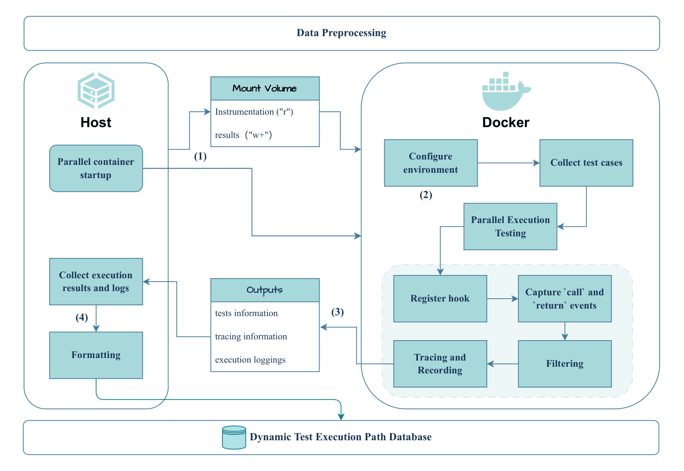

# Dynamic trace collection

[English](README.md) · [简体中文](README.zh-CN.md)

<p align="center">
  
</p>

> Batch dynamic test-execution tracing for the [IssueExec](https://github.com/code-philia/IssueExec) artifact.

[](https://github.com/code-philia/IssueExec)
[](https://arxiv.org/abs/2607.17286)

This repository contains the **Dynamic trace collection** stage used by IssueExec. It executes the tests shipped with SWE-bench Docker environments, records the Python functions reached by each passing test, and materializes a per-instance dynamic execution-path database. The resulting traces are consumed by IssueExec's test-driven issue localization pipeline.

This repository is intentionally scoped to trace collection and trace post-processing. It does **not** implement IssueExec's issue-localization model, prompt construction, or evaluation code.

## Role in IssueExec

```text
SWE-bench instance + Docker image
          │
          ▼
  Dynamic trace collection (this repository)
          │  tests-info.json + traces.json
          ▼
  IssueExec: issue → relevant tests → dynamic paths → candidate locations
```

For every instance, each test is executed in isolation under a profiler hook. Calls are restricted to Python files below the project root, de-duplicated, and stored as caller–callee edges. Failed tests are excluded from the trace database and reported separately; skipped tests are retained with an explicit status.

## Repository layout

```text
Dynamic_Coverage_Map/
├── run_dockers.py             # parallel batch runner for SWE-bench images
├── pull_dockers.py            # image discovery and parallel downloading
├── generate_swebench_list.py  # build an image-tag list from a HF dataset
├── prepare_repos.py           # optional local checkout preparation
├── utils/                     # tracer injected into each container
│   ├── trace.py               # pytest collection and per-test tracing
│   └── hooks.py               # sys.setprofile call/return hook
├── parse_coverage_map.py      # traces → test-to-functions map
├── parse_call_graph.py        # traces → graph (nodes and edges)
├── parse_call_tree.py         # traces → tree, compact, or graph text
├── repair_results.py          # repair/normalize existing result folders
└── swebench_lite_images.txt   # example image-tag list
```

## Requirements

- Docker Engine and permission to run containers;
- Python 3.8+ (the IssueExec experiments used conda environment `agentless`);
- SWE-bench-compatible Docker images with a `testbed` environment;
- host packages: `docker`, `datasets`, `requests`, `tqdm`, and `pytest`;
- container packages: `pytest-json-report` and `pytest-cov` (installed by `run_dockers.py`).

The full image set is large; plan for substantial Docker disk, memory, and CPU usage.

## Installation

```bash
git clone git@github.com:AWGiaGia/swe-tools.git
cd swe-tools
python -m venv .venv
source .venv/bin/activate
python -m pip install --upgrade pip
python -m pip install -r requirements.txt
```

## Reproducing a batch

### Generate an image list (optional)

```bash
python Dynamic_Coverage_Map/generate_swebench_list.py \
  --dataset /data/swe-bench-lite \
  --output Dynamic_Coverage_Map/swebench_lite_images.txt
```

### Pull images (optional)

```bash
python Dynamic_Coverage_Map/pull_dockers.py \
  --prefix sweb.eval.x86_64.scikit-learn \
  --image-file Dynamic_Coverage_Map/swebench_lite_images.txt \
  --use-ghcr --workers 4 --dry-run

python Dynamic_Coverage_Map/pull_dockers.py \
  --prefix sweb.eval.x86_64.scikit-learn \
  --image-file Dynamic_Coverage_Map/swebench_lite_images.txt \
  --use-ghcr --workers 4 --max 2
```

The downloader skips local images and retags GHCR images to the SWE-bench convention by default. Use `--proxy`, `--no-skip-existing`, or `--no-retag` when needed.

### Run Dynamic trace collection

Start with a bounded smoke test:

```bash
python Dynamic_Coverage_Map/run_dockers.py \
  --script-dir "$PWD/Dynamic_Coverage_Map/utils" \
  --result-dir "$PWD/results" \
  --log-dir "$PWD/logs" \
  --image-prefix ghcr.io/epoch-research/swe-bench.eval.x86_64 \
  --parallel 4 --max 2 --enable-timeout
```

Remove `--max 2` for the complete image set. `--parallel` controls the number of containers. `--docker-timeout SECONDS` sets a per-container limit; `--enable-timeout` alone enables the seven-hour default.

The runner mounts `utils/` read-only at `/host_scripts` and each instance's result directory at `/workspace/result`, then invokes `trace.py` in the image's `testbed` environment.

### Trace a checked-out project directly

```bash
python Dynamic_Coverage_Map/utils/trace.py \
  --project-root /path/to/project \
  --output-dir ./results/local-smoke \
  --max-tests 5 --max-workers 2 --random True --random-seed 42
```

## Output contract

```text
results/<instance-id>/result/
├── tests-info.json
├── traces.json
├── progress.txt
├── trace_runtime.log
├── failed_tests.txt       # when tests fail
├── skipped_tests.txt      # when tests are skipped
└── error_logs/            # per-test diagnostics
logs/batch_run_YYYYMMDD_HHMMSS/
├── batch_run.log
└── <instance-id>.log
```

`tests-info.json` is the pytest JSON discovery report. `traces.json` is the core Dynamic Test Execution Path Database input for IssueExec:

```json
{
  "test-id": "sklearn/tests/test_example.py::test_basic",
  "test-func-id": "sklearn/tests/test_example.py:12:test_basic",
  "call-relations": [
    {
      "caller": {"filepath": "sklearn/model.py", "lineno": 42, "func_name": "fit", "class_name": "Model"},
      "callee": {"filepath": "sklearn/utils.py", "lineno": 18, "func_name": "validate_data", "class_name": ""}
    }
  ]
}
```

Paths are relative to the project root and duplicate edges within one test are removed. A skipped record has an empty `call-relations` list and `"status": "skipped"`; failed tests are listed in `failed_tests.txt`.

## Post-processing

```bash
python Dynamic_Coverage_Map/parse_coverage_map.py \
  --source_folder ./results --save_folder ./results_coverage \
  --substring scikit-learn

python Dynamic_Coverage_Map/parse_call_graph.py \
  --source_folder ./results --save_folder ./results_call_graph \
  --substring scikit-learn

python Dynamic_Coverage_Map/parse_call_tree.py \
  --source_folder ./results --save_folder ./results_call_tree \
  --substring scikit-learn --format tree
```

The converters produce, respectively, `test_id → covered_functions`, explicit/compact call graphs, and tree/compact/graph representations for downstream IssueExec analysis.

## Design and reproducibility notes

1. `trace.py` discovers tests with pytest's JSON report plugin and removes parametrization suffixes.
2. A separate process executes each selected test. `hooks.py` installs `sys.setprofile` and captures `call`/`return` events.
3. Only Python functions below the project root are retained; source-relative locations, line numbers, function names, and class names are recorded.
4. Passing tests contribute traces; skipped tests are explicit; failures produce diagnostics without contaminating `traces.json`.
5. The Docker runner isolates instances and preserves per-instance logs for resumable batches.

Compatibility paths are included for Django and Astropy repositories, including automatic disabling of incompatible legacy Astropy pytest plugins.

## Troubleshooting

- **No images found:** make `--image-prefix` match `docker image ls`.
- **Empty traces:** inspect `tests-info.json`, `failed_tests.txt`, and the instance log; retry with `--max 1 --max-tests 5`.
- **Collection/plugin errors:** check for `astropy_plugins_disabled.marker` and the runtime log.
- **Timeouts:** lower `--parallel` or set a larger `--docker-timeout`.

## Citation

```bibtex
@article{liu2026issueexec,
  title={IssueExec: A Test-Driven Approach for Localizing Software Engineering Issues},
  author={Liu, Jiawei and Lin, Yun and Liu, Chenyan and Qian, Yu and Liu, Yiming and Chang, Jiaxin and Zhang, Weinan and Huang, Linpeng},
  journal={arXiv preprint arXiv:2607.17286},
  year={2026}
}
```

## Related resources

- [IssueExec code repository](https://github.com/code-philia/IssueExec)
- [IssueExec paper on arXiv](https://arxiv.org/abs/2607.17286)
- [This repository](https://github.com/AWGiaGia/swe-tools)
